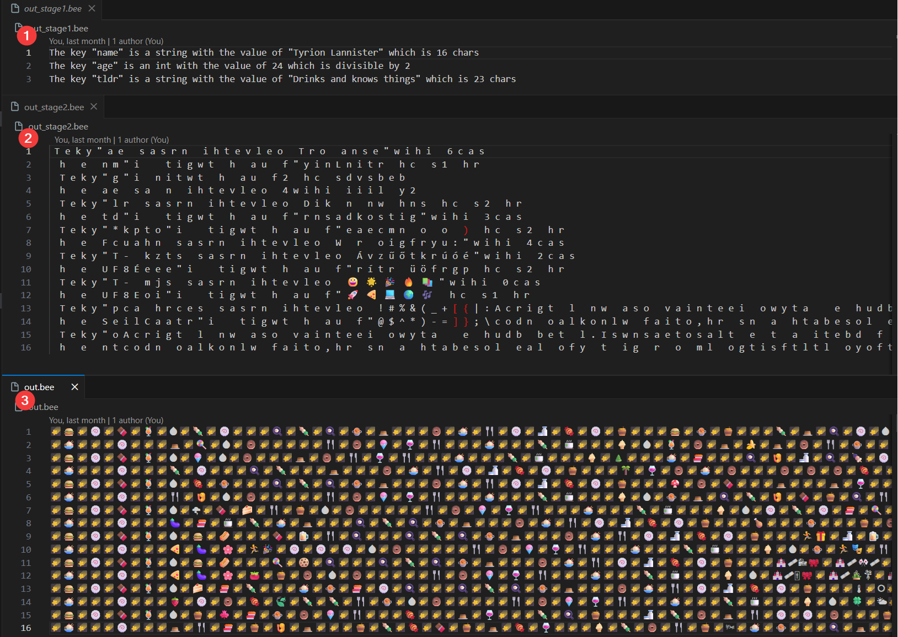

# 🐝 BEE Encoding (The "Fuckupathon" Special)
Created by Novy & Szaki during the November 2025 Fuckupathon organized by Adroit Group.

## 🧐 What is BEE?
BEE (Binary-Emoji-Encoding) is a next-generation serialization format designed specifically to make fellow engineers cry and yell "But why?!" in an open-office environment.

While the rest of the world is obsessed with speed and "JSON schema validation," we decided to prioritize The Bee Movie (2007) and maximum computational overhead.

## 🛠 The "Pipeline of Pain"

To ensure your data is absolutely unreadable by any sane human or machine, BEE follows a 4-step transformation process:

1. Natural Language: We take a simple key-value pair and turn it into a polite, long-winded sentence.
    - Input: `{"age": 24}`
    - Output: `"The key 'age' is an integer with the value of 24"`
2. The Checkered Pattern (Interleaving): We take one character from the top and one from the bottom, spreading the data across two lines until the original sentence is unrecognizable.
3. Emoji Transliteration: Because ASCII is boring, the resulting pattern is mapped to a emojis.
4. Bee-Movie Steganography: The final emoji-encoded string is injected into the metadata/pixels of a high-resolution frame from The Bee Movie (inverted).

## ⚠️ Disclaimer
This project was built for a hackathon where the goal was to build the "worst" possible solution. Use this in production at your own risk. We are not responsible for any mental breakdowns caused by trying to debug a checkered emoji pattern hidden in a PNG of a bee in a sweater.

Special thanks to Adroit Group for providing the space to commit these architectural sins.